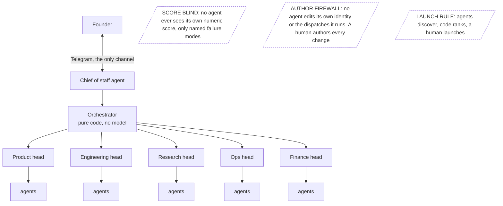

# shayke-public

An agent fleet that builds a sales product overnight and publishes its own build ledger. Every landing, halt and correction, hash chained daily. Built by one person for enterprise sales reps who are tired of feeding a CRM by hand.

<!-- DEMO: real capture of the ledger updating from a live run. If this line is still here, no capture existed at build time. -->

## How it's wired

## Why I built this

I came to this from selling, not from engineering. Five months in enterprise sales and a year in a smaller sales role before that. Not long, but long enough to learn where the job actually goes wrong. It was never the selling. It was the hours after, turning messy calls and half remembered promises into CRM fields nobody trusted anyway. Every tool that promised to fix it either made things up or needed a data team to run. I wanted the version that gets it right, proves it got it right, and stays out of the way. Shayke is that, and this repo is the part of it I can show.

## What's actually in here

This is the public window onto a private system. The product and the fleet that builds it live in private repos. Claims about those repos can't be verified from this page, and I've written this so you don't have to take them on faith where I can show you instead.

**`ledger/`** is the honest bit. Every day a script reads the committed dispatch reports from the private repos and writes one JSON record here: which build dispatches landed, which halted, which died without a report, the test count stamped by the run that produced it, the eval verdict per build (GREEN, RED or UNKNOWN), and tokens and cost per run once the runner can attribute them to a dispatch (until then those fields are null, never estimated). Each day's record hashes the previous one, so the history can't be quietly edited. The corrections ledger is in there too. Those are my own mistakes, classed by type, marked settled or open. Halts and corrections are published on purpose. A green wall tells you nothing. Entries before the ledger went live were backfilled from committed reports and are marked as such.

**`fleet/census.json`** lists every agent: name, department, model tier, cadence, and two separate status fields, registered and running. They're separate because conflating them is how fleets get oversold.

**`lib/quotable_span/`** is the one piece of runnable code, MIT licensed. It's an LLM as judge check with one rule: the grader has to quote the exact words behind its verdict, and that quote has to appear character for character in the graded text, or the verdict is VOID. It proves the quote is real, not that it's relevant, and human agreement is under measured. The README in that folder says so plainly and shows its own eval results, wrong cases included.

**`docs/`** holds the things a customer's engineers would ask for before a pilot: a pilot runbook, a data flow document, the product's success metric and why the volume metrics were rejected, and a summary of what broke when adversarial personas used the product.

## What I can say about the private side

These are the claims I'm prepared to stand behind, worded as tightly as the evidence allows:

- Guarded Salesforce writes proven live against a Dev org, field compared, audit logged with per field provenance.
- The eval harness runs green in CI with live scoring.
- One AI grades another; the grader must quote the exact words behind its verdict and the quote must appear character for character in what was graded or the pass voids. It enforces that the quote is real, not that it's relevant; human agreement is under measured.
- Our adversarial harness caught a confidently reported fix and blocked release before any customer saw the product.
- Artefacts can lie without anyone lying; doc stated counts are stale by default unless machine checked.
- Encryption at rest: per user AES 256 GCM default for new writes, legacy read fallback enabled.

No customers yet. I use it myself. The fleet runs on one machine with hard per run token caps and a spend breaker, and I'd rather tell you that than let you guess.

## What this is not

Not a framework. Not a demo of an AI running sales calls, which is permanently out of scope. Not a claim that any of this scales past one person until it has.

## Licence

All rights reserved, except `lib/quotable_span/`, which is MIT licensed and can be used freely. Everything else in this repository is published for reading only.
